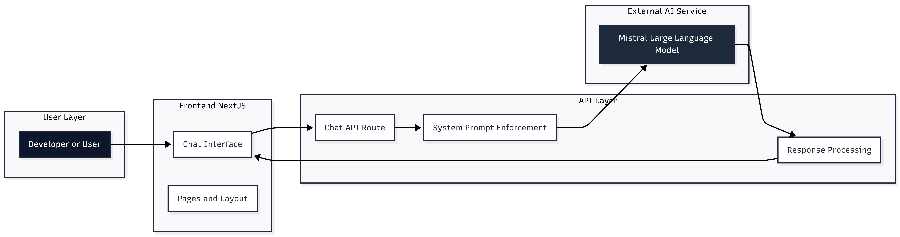

# CodePilot

An AI-powered coding assistant built entirely with Next.js, designed to answer programming and software development questions with concise, professional responses.

**Live Demo:** https://codepilot-live.vercel.app/

---

## Overview

CodePilot is a focused AI coding assistant that helps developers generate, debug, and understand code through a clean chat interface.

Unlike general AI chatbots, CodePilot is intentionally restricted to technical topics. It responds only to programming, computer science, and software development queries — ensuring high signal, no noise.

The entire application (frontend and backend logic) is built inside a single Next.js project using the App Router architecture.

---

## Architecture Overview

CodePilot follows a simple and efficient architecture:

1. User enters a programming question in the UI
2. The frontend sends the message to a Next.js API route
3. The API route communicates with the Mistral LLM
4. The response is processed and returned to the UI
5. The assistant enforces strict coding-only behavior

Since it is a pure Next.js project, there is no separate backend server. API routes handle all AI communication.




---

## Repository Structure

```
codepilot/
├── app/
│   ├── api/
│   │   └── chat/
│   ├── globals.css
│   ├── layout.tsx
│   └── page.tsx
├── components/
├── lib/
│   └── utils.ts
├── public/
├── next.config.ts
├── package.json
└── tsconfig.json
```

### Folder Responsibilities

**app/**
- Uses Next.js App Router
- Contains both UI pages and backend API route
- `/api/chat` handles AI communication

**components/**
- Reusable UI components for chat interface

**lib/**
- Utility functions
- Tailwind class merging helper

**public/**
- Static assets

---

## Core Features

- AI-powered coding assistant
- Strict coding-only response enforcement
- Mistral LLM integration
- Clean developer-focused UI
- Full-stack implementation using only Next.js
- Lightweight and production-ready deployment

---

## AI Behavior Design

CodePilot is governed by a system-level instruction that ensures:

- It answers only programming and computer science questions
- It rejects non-technical questions
- It responds professionally and concisely
- It handles greetings appropriately
- It avoids general knowledge discussions

This makes it a purpose-built developer assistant rather than a generic chatbot.

---

## Technology Stack

**Framework**
- Next.js (App Router)
- TypeScript
- React

**Styling**
- Tailwind CSS
- clsx
- tailwind-merge

**AI Integration**
- Mistral Large Language Model
- Secure API key handling via environment variables

**Deployment**
- Hosted on Vercel

---

## Environment Variables

Create a `.env.local` file and configure:

```
MISTRAL_API_KEY=your_mistral_api_key
```

This is required for AI responses to function.

---

## Local Development

1. Clone the repository
2. Install dependencies
3. Configure environment variables
4. Run development server
5. Open localhost in browser

The application runs entirely on Next.js without any additional backend service.

---

## Design Principles

- Full-stack within a single Next.js project
- Minimal and clean architecture
- Strict domain-focused AI behavior
- Stateless API route design
- Developer-first experience
- Production-ready deployment model
